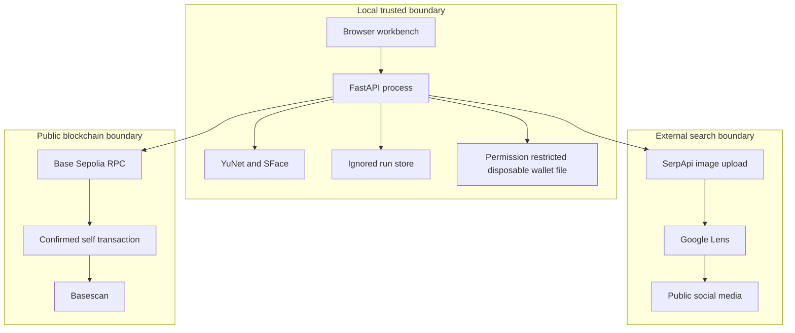

# FaceProof architecture

## Goals

FaceProof must make one complete claim easy to inspect:

1. A fresh visual search discovered a public social post.
2. A local face model found a candidate image above a stated comparison threshold.
3. A precise evidence document was fingerprinted.
4. A public Base Sepolia transaction contains that fingerprint.
5. Reading the transaction again produces the same result for unchanged evidence and a failure for changed evidence.

The design also keeps raw images, face embeddings, API keys, and private wallet material offchain.

## System boundaries



The local browser talks only to `127.0.0.1`. The server is the only component that reads secrets, writes run artifacts, contacts the search provider, and signs a transaction.

## Stage model

Every run has six ordered stages:

| Stage | Work | Durable output |
|---|---|---|
| Face | Decode, orient, detect, align, and encode the selected face | Normalized input, crop, annotated image, model metadata, image fingerprints |
| Search | Submit the crop and full image as two new Google Lens searches | Provider search IDs, status, timestamps when supplied, result counts, public candidates |
| Compare | Download bounded candidate media and compare each encoded face | Candidate scores, errors, local image copies, selected match |
| Evidence | Write deterministic JSON and calculate SHA-256 | Readable manifest, canonical manifest, evidence fingerprint |
| Publish | Sign and send one zero value Base Sepolia self transaction | Transaction hash, block, wallet addresses, public explorer URL |
| Verify | Read the transaction and compare the exact expected bytes | Verification result, time, and confirmation count |

States are `created`, `running`, `awaiting_publish`, `publishing`, `verified`, `rejected`, `failed`, and `canceled`. Each transition is written atomically to `state.json`. Partial search and comparison results remain available after a failure or rejection.

## Face processing

YuNet locates faces and five facial landmarks. SFace aligns the selected face and returns a 128 value feature vector. The vector is normalized in memory. Candidate comparison uses the dot product of normalized vectors, which is cosine similarity.

Ordinary visual results must meet FaceProof's conservative `0.45` application threshold. A result returned by Google Lens in its exact-match section may use `0.363`, the cosine reference published in the [official OpenCV Zoo SFace implementation](https://github.com/opencv/opencv_zoo/blob/main/models/face_recognition_sface/sface.py). These are model decision boundaries, not probabilities or measures of legal identity. A passing result still waits for human approval or rejection. The largest face is selected when several faces appear, and the run warns about that choice.

YuNet's detection cutoff is `0.80`. Detection only decides whether a usable face is present. It does not influence the SFace identity threshold.

Model files come from the official OpenCV Zoo. Their URLs and SHA-256 values are pinned in source. A missing or changed download cannot be used silently.

## Genuine search design

The search stage makes two new provider requests for every run:

1. A contextual crop around the selected face.
2. The complete normalized input image.

Both Google Lens requests use `no_cache=true`. Candidate links are derived only from the returned provider response. They are not stored in source code and no result is selected before the request.

Only HTTP and HTTPS links on the configured social domain allowlist are considered. Lookalike hostnames are rejected. Each distinct post is kept once. FaceProof then downloads the returned media or thumbnail and makes its own local face decision.

## Evidence contract

The evidence manifest covers:

- The input image SHA-256 value and selected face location.
- The exact detector and recognizer model names.
- All provider search traces used by the run.
- The selected public post URL, source title, media URL, and retrieved media SHA-256 value.
- The face comparison metric, score, threshold, and decision.
- A declaration of what was not stored onchain.

Canonical encoding sorts object keys, uses UTF-8, normalizes strings to Unicode NFC, rejects nonfinite numbers, and removes insignificant spaces. See [docs/EVIDENCE_SCHEMA.md](docs/EVIDENCE_SCHEMA.md).

## Blockchain record

FaceProof does not start a local blockchain and does not deploy a smart contract. It sends one normal EVM transaction on public Base Sepolia.

The disposable wallet sends zero ETH to itself. Its data field contains:

```text
46 41 43 45 50 52 4f 4f 46 01 <32-byte SHA-256 digest>
 F  A  C  E  P  R  O  O  F v1
```

The prefix prevents the digest from being confused with unrelated transaction data. The version byte allows a later evidence format to use a new interpretation without weakening old records.

A smart contract was not needed for this claim. A normal transaction already supplies public inclusion, block time, sender authentication, immutable data, and independent retrieval. Removing contract deployment reduces gas, code, and failure surface.

Publication is serialized with a process lock so concurrent clicks cannot reuse the same wallet nonce. Verified publication is idempotent within a run. The user interface also disables the action while it is in progress.

## Verification algorithm

The verifier performs these checks:

```text
expected_digest = SHA256(canonicalize(evidence.json))
expected_payload = UTF8("FACEPROOF") || 0x01 || expected_digest

pass when:
  rpc.chain_id == 84532
  and receipt.status == 1
  and transaction.chain_id == 84532
  and transaction.from == transaction.to
  and transaction.input == expected_payload
```

The browser, saved run command, and standalone evidence file command all use the same verifier.

## Threat model

| Risk | Control | Remaining risk |
|---|---|---|
| A malicious upload consumes memory or decoder time | Type allowlist, byte limit, Pillow decode, pixel limit, and normalized output | Carefully crafted image decoder flaws remain a dependency risk |
| A search result targets the local network | HTTP and HTTPS only, no URL credentials, DNS resolution, global IP requirement, redirect recheck, byte limit | DNS can change between resolution and connection |
| A lookalike social hostname is accepted | Exact hostname or subdomain boundary comparison | A legitimate platform can still host misleading content |
| A model file is replaced | Pinned source and SHA-256 verification | The upstream model itself is trusted |
| A weak result is presented as certain | Local comparison threshold, visible score, visible threshold, and no forced match | Model bias and false matches still exist |
| Evidence changes after review | Digest is recomputed immediately before publication | A user can approve incorrect evidence if they do not review it |
| A transaction is sent twice | Explicit approval, disabled button, server state guard, and publication lock | Separate application processes sharing one wallet need external nonce coordination |
| A secret reaches Git | Secrets and all runtime files are under ignored paths | A user can still copy a secret into a tracked file |
| A malicious page controls the local app | Loopback binding, trusted host validation, same origin mutation checks, Content Security Policy, no framing, no browser permissions | There is no user authentication because the app is local only |
| The public post disappears | Local image hash and source metadata remain in evidence | FaceProof is not a permanent content archive |

## Failure behavior

Expected failures use public error codes and recovery text. Internal exceptions are logged without being sent to the browser. A failed current stage is marked clearly. Earlier evidence remains visible.

No match is a valid outcome. The pipeline stops instead of lowering the threshold or selecting an unevaluated item. Publication failure keeps the local evidence and does not claim verification.

Cancellation is disabled after blockchain signing begins. Canceling an asynchronous local task cannot unsend a transaction that has already reached the network, so the safe recovery is to wait and verify its receipt.

## Production changes

This submission is intentionally a local reviewer tool. A shared production service would also need authenticated users, encrypted object storage, retention controls, a job queue, per-user quotas, an audited key management service, provider terms review, rate limiting, database transactions, nonce coordination across workers, monitoring, and a formal biometric privacy review.
