# FaceProof

FaceProof takes a face image, performs a fresh search for public social content, checks candidate faces locally, and records a fingerprint of the selected evidence on Base Sepolia.

It is the complete submission project for HH Goa 2026 Shortlisting Task 3.

> FaceProof shows that a face in two images is similar enough under a stated model and threshold. It does not prove a person's legal identity.

## Why this project exists

A face search can find a public post, but a search result can change or disappear later. FaceProof creates a precise evidence record at the time of review. It then stores the SHA-256 fingerprint of that record in a public Base Sepolia transaction.

Anyone can later calculate the fingerprint again and compare it with the transaction. A match proves that the checked evidence has not changed since publication. A mismatch shows that at least one covered value changed.

The blockchain does not decide whether the person is who they claim to be. It also does not prove that a social post is true. FaceProof uses it only as a public record of the exact evidence that a reviewer approved.

## What the judges can verify

| Task requirement | FaceProof implementation | Visible proof |
|---|---|---|
| Detect and encode a face | OpenCV YuNet detects faces. OpenCV SFace aligns the selected face and creates a 128 value embedding. | The detected face, model names, face count, and completed stage appear in the run. |
| Find a real social post | The detected face crop and full input image each start a new SerpApi Google Lens request with cache disabled. Results are filtered to public social domains. | The original post link, two search traces, and all evaluated candidates remain in the run record. |
| Confirm the match | Every downloadable candidate image is encoded locally and compared with cosine similarity. Results below the configured threshold are rejected. | The selected images, exact score, threshold, and candidate list are shown together. |
| Upload to a blockchain | A SHA-256 fingerprint of canonical evidence JSON is placed in the data field of a zero value Base Sepolia transaction. | The transaction hash, block number, confirmations, and public Basescan link are shown. |
| Verify the blockchain record | FaceProof recomputes the fingerprint, reads the transaction through a public RPC endpoint, and compares the exact payload. | The final stage passes only when the local evidence and public transaction agree. |

## Pipeline

```mermaid
flowchart LR
    A[Face image] --> B[YuNet detection]
    B --> C[SFace embedding]
    C --> D[Two fresh Google Lens searches]
    D --> E[Public social candidates]
    E --> F[Local face comparison]
    F --> G[Canonical evidence JSON]
    G --> H[SHA-256 fingerprint]
    H --> I[Approval]
    I --> J[Base Sepolia transaction]
    J --> K[Read back and verify]
```



The first four stages prepare evidence. Publication is a separate approval step. Only the schema marker and the 32 byte fingerprint are public. Images, face embeddings, the wallet key, and the search key remain offchain.

## What happens during one run

1. The reviewer selects an image and confirms that they have permission to use it for public visual search.
2. FaceProof decodes the upload, removes metadata, normalizes the image, and deletes the raw upload after decoding.
3. YuNet detects the largest face. SFace aligns that face and creates a 128 value mathematical representation in memory.
4. FaceProof sends the face crop and the normalized full image to two new Google Lens searches through SerpApi. Provider caching is disabled.
5. FaceProof keeps public social results, downloads permitted candidate images with strict safety limits, and compares each detected face locally.
6. The interface shows the best passing candidate, its source, the exact comparison score, the required threshold, and the other evaluated candidates.
7. The reviewer can approve or reject the result. A rejected result cannot be published.
8. After approval, FaceProof creates canonical evidence JSON and calculates its SHA-256 fingerprint.
9. The wallet sends a zero value Base Sepolia transaction to itself. The transaction contains the FaceProof version marker and the evidence fingerprint.
10. FaceProof waits for confirmation, reads the public transaction, calculates the local fingerprint again, and checks that both values are identical.

## Validated public result

The project completed a live run on September 3, 2026 with a licensed portrait of Sundar Pichai. A new Google Lens search found a matching [Stanford social post](https://www.facebook.com/Stanford/posts/sundar-pichai-ceo-of-google-and-alphabet-inc-and-a-stanford-alum-will-return-to-/1363544992482875/). SFace gave the selected candidate a cosine similarity score of `0.954334`, above the required `0.45` threshold.

The approved evidence produced fingerprint `c759628e8dd16e3f5bb397e52f0db4746739dcb8694dccd05de401a753053a0e`. FaceProof published it in [Base Sepolia transaction 0x7053...6975](https://sepolia.basescan.org/tx/0x7053f316d2955ce978245318450dcf2b94c30702a71bd7d7c966eb687a1d6975) at block `46336968`, then read the transaction and verified the evidence again.

See [the validated public run](docs/VALIDATED_RUN.md) for the search records, selected social post, evidence fingerprint, Base Sepolia transaction, and repeat verification from September 3, 2026.

FaceProof uses a conservative `0.45` application threshold for ordinary visual results. An item returned by Google Lens in its exact-match section may use the `0.363` cosine reference published in the [official OpenCV Zoo implementation](https://github.com/opencv/opencv_zoo/blob/main/models/face_recognition_sface/sface.py). Both values are configurable model boundaries, not identity probabilities. Every passing result still requires human approval or rejection before publication.

YuNet uses a `0.80` face detection cutoff so clear portraits with glasses or varied lighting are not discarded before comparison. This only decides whether a face is present. It does not lower the separate identity comparison threshold.

## Cost and accounts

The project can run without spending real money.

- SerpApi currently offers a free plan with 250 searches each month. One FaceProof run normally uses two searches. See the [official pricing page](https://serpapi.com/pricing).
- Base Sepolia is a public test network. Its test ETH is free and has no real monetary value.
- FaceProof creates a disposable wallet file inside `.context`, which Git ignores. It does not install a browser wallet and it does not run a blockchain on your computer.
- A faucet can require an account or sign in. Start from the [official Base faucet list](https://docs.base.org/base-chain/tools/network-faucets) or the [Coinbase Developer Platform faucet](https://portal.cdp.coinbase.com/products/faucet).

Do not send real ETH or any other real asset to the FaceProof wallet.

## Quick start

### Requirements

- macOS or Linux
- Python 3.12
- [uv](https://docs.astral.sh/uv/getting-started/installation/)
- A SerpApi key
- A small amount of free Base Sepolia test ETH

### 1. Install the project

```bash
git clone https://github.com/sillanaresh/hhgoa-task3.git
cd hhgoa-task3
./scripts/setup.sh
```

The setup script installs locked dependencies, downloads the pinned face models, verifies their SHA-256 values, and creates `.context/secrets.env` when needed.

### 2. Add the live search key

Create a free SerpApi account, then copy the key from the [official key page](https://serpapi.com/manage-api-key). Open `.context/secrets.env` and set:

```dotenv
SERPAPI_API_KEY=your_key_here
```

The file is ignored by Git. Do not put the real key in `.env.example`, a command, a screenshot, an issue, or a commit.

### 3. Create and fund the test wallet

```bash
uv run faceproof wallet-create
```

Copy the printed public address into a Base Sepolia faucet. Request test ETH for that address. The private key stays in `.context/base-sepolia-wallet.json` with owner only file permissions.

Check every dependency:

```bash
uv run faceproof doctor
```

All five checks should say `Ready` or `Reachable` before recording the demo.

### 4. Prepare the licensed demo image

```bash
./scripts/demo-input.sh
```

This downloads a pinned portrait of Sundar Pichai from Wikimedia Commons into the Git-ignored `.context/input` directory and verifies its SHA-256 value. The photograph is by Lukasz Kobus for the European Commission and is available under [CC BY 4.0](https://commons.wikimedia.org/wiki/File:Sundar_Pichai_(2023)_cropped.jpg). The portrait is only the input. FaceProof does not contain or preselect the social result returned by the live search.

For the final recording, run the strict readiness and repository gate together:

```bash
./scripts/preflight.sh
```

### 5. Start the workbench

```bash
./scripts/demo.sh
```

Open [http://127.0.0.1:8765](http://127.0.0.1:8765) if it does not open automatically.

Use a clear image of a public figure whose exact or similar photo is present in a public social post. Confirm the permission statement, run the live search, inspect the selected result, approve publication, and verify the public transaction.

## Command line use

Run the full preparation pipeline without publishing:

```bash
uv run faceproof run path/to/face.jpg
```

Run it and publish after preparation:

```bash
uv run faceproof run path/to/face.jpg --publish
```

Verify a saved run again:

```bash
uv run faceproof verify RUN_ID
```

Verify any exported evidence file directly against a public transaction:

```bash
uv run faceproof verify-file evidence.json 0xTRANSACTION_HASH
```

Print the deterministic fingerprint without using the blockchain:

```bash
uv run faceproof hash-evidence evidence.json
```

## What is stored on Base Sepolia

FaceProof uses a normal EVM transaction instead of deploying a smart contract. The wallet sends a zero value transaction to its own address. The transaction data is:

```text
UTF-8 bytes for FACEPROOF + version byte 0x01 + 32 byte SHA-256 fingerprint
```

This design creates a public, timestamped, tamper evident record with less code and less gas than a contract deployment. Verification checks all of these facts:

1. The RPC endpoint reports Base Sepolia chain ID `84532`.
2. The transaction succeeded.
3. The sender and receiver are the same disposable wallet.
4. The transaction data equals the schema marker and recomputed evidence fingerprint.
5. The transaction exists in a confirmed block.

See [ARCHITECTURE.md](ARCHITECTURE.md) for the full design and threat model.

## Evidence format

Each run writes its files to `.context/runs/<run-id>/`. The important files are:

- `evidence.json`: readable evidence with the input fingerprint, live search traces, selected public source, retrieved media fingerprint, face score, threshold, and privacy declaration.
- `evidence.canonical.json`: the same covered data encoded as sorted UTF-8 JSON with Unicode normalization and no insignificant spaces.
- `state.json`: the resumable local run record and blockchain receipt.
- `input.jpg`, `face.jpg`, `annotated.jpg`, and candidate images: local review copies.

The SHA-256 value is calculated from `evidence.canonical.json`. Changing any covered value changes the fingerprint and makes verification fail.

See [docs/EVIDENCE_SCHEMA.md](docs/EVIDENCE_SCHEMA.md) for the field level contract.

## Testing and security checks

```bash
./scripts/check.sh
```

The check runs formatting, lint, strict type checking, unit and integration tests with coverage, a Bandit source scan, a dependency vulnerability audit, a scan for common secret shapes, and a release package asset check. CI runs the same checks on every pull request.

The test suite covers canonical fingerprints, tamper detection, social URL filtering, fresh search parameters, model file integrity, image limits, wallet permissions, the complete pipeline with deterministic service doubles, blockchain payload verification, and API security headers.

## Secrets and local data

The public repository contains no live API key, wallet private key, input photograph, or private run data. FaceProof keeps all of those files under `.context/`, and Git ignores that entire directory.

- `.env.example` contains placeholders only.
- `.context/secrets.env` contains the local SerpApi key.
- `.context/base-sepolia-wallet.json` contains the disposable wallet private key and uses owner only file permissions.
- `.context/input/` and `.context/runs/` contain local images and evidence files.
- `scripts/secret_scan.py` checks tracked project files for common secret formats.
- `scripts/preflight.sh` runs the secret scan before a recording or release.

The wallet address, evidence fingerprint, transaction hash, and block number are public verification values. They cannot be used to spend from the wallet. Never commit or display the corresponding private key.

## Privacy and responsible use

- Search begins only after the user confirms permission to use the image.
- The image is sent to SerpApi and Google Lens because that is required for visual search. The interface says this before submission.
- Face embeddings exist in memory only. They are not written to disk or sent to the blockchain.
- Raw images, social content, API keys, and wallet keys are never placed onchain.
- Remote images have strict byte limits. Private network addresses and unsafe URL schemes are blocked.
- Browser responses include a restrictive Content Security Policy and other security headers.
- The system reports a similarity score and threshold. It never labels the score as certainty or legal identity.

Read [SECURITY.md](SECURITY.md) before using the project with any image that is not already public.

## Known limitations

- Google Lens results depend on region, indexing, account quota, and the public web at the time of the run.
- Some social sites block automated image downloads. FaceProof tries the returned media and thumbnail URLs, but a candidate can remain unevaluated.
- Face recognition can be wrong. Lighting, age, pose, occlusion, image quality, demographic bias, and model limitations affect the score.
- The largest detected face is selected when several faces appear.
- A public post can later change or disappear. The evidence keeps its URL, title, search provenance, and retrieved image fingerprint, but this project does not publish a permanent media archive.
- Base Sepolia is a test network. It demonstrates public verification but is not intended as a permanent production ledger.
- The local run store is designed for one reviewer on one computer. It is not a shared, authenticated production service.

## Repository map

```text
src/faceproof/
  api.py          Local FastAPI interface and security headers
  face.py         YuNet detection and SFace comparison
  search.py       Fresh SerpApi Google Lens searches
  evidence.py     Canonical evidence and SHA-256 fingerprint
  blockchain.py   Base Sepolia publication and verification
  pipeline.py     State machine and failure handling
  static/         Judge-facing workbench
tests/            Unit and deterministic integration tests
docs/             Evidence, testing, and recording guides
scripts/          Setup, checks, and demo entry points
```

## Submission recording

Follow [docs/RECORDING.md](docs/RECORDING.md). It gives a short recording order that proves the live search, local comparison, public transaction, and repeat verification without exposing any secret.

## License

This project is released under the [MIT License](LICENSE).
